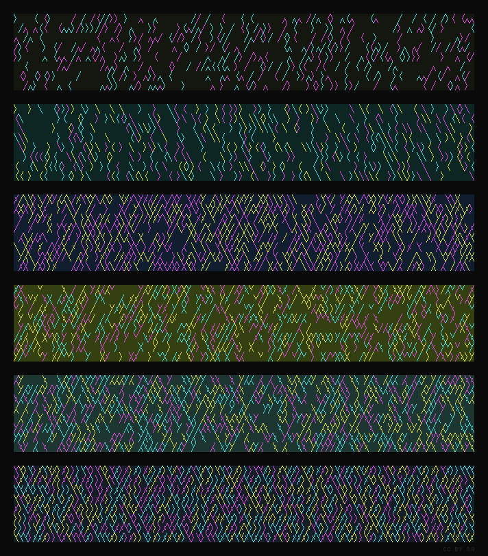

# fs-bs
### *forward-slash, back-slash*

This is little more than a Python script which spits about a lot of colourful lines using truecolour terminal emulator support and some fancy font glyphs.

To use it yourself, you basically need:

- [Terminess Breathe](https://github.com/blieque/terminess-breathe), my version of Terminus Powerline, for special custom Unicode characters.
- A terminal emulator that supports 24-bit truecolour. Many modern emulators support it, but check [here](https://gist.github.com/XVilka/8346728) if you're curious.

